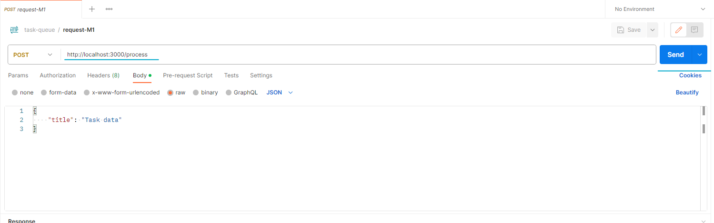
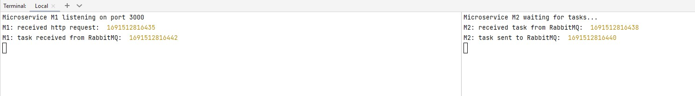

# Node.js Microservices Project

This project demonstrates a simple implementation of asynchronous 
HTTP request processing using Node.js and RabbitMQ. It consists 
of two microservices, microservice-1 and microservice-2, that work together to handle
incoming HTTP requests and process tasks asynchronously.

## Features

- Microservice M1: Receives incoming HTTP requests and publishes tasks to RabbitMQ.
- Microservice M2: Consumes tasks from RabbitMQ, processes them, and publishes results back to RabbitMQ.
- RabbitMQ: Message broker used for communication between microservices.
- Express: Framework used for handling HTTP requests and responses.

## Prerequisites

Before you begin, make sure you have the following tools installed on your machine:

- [Node.js](https://nodejs.org/): Download and install Node.js from the official website.
- [RabbitMQ](https://www.rabbitmq.com/): Download and install RabbitMQ on your machine.


## Setup

1. Clone this repository to your local machine.
2. Install Node.js and npm if not already installed.
3. Navigate to the `microservice-1` directory:

```
   cd microservice-1
```

4. Install project dependencies:

```
   npm install
```
5. Navigate to the `microservice-2` directory:

```
   cd microservice-2
```

6. Install project dependencies:

```
   npm install
```

## Usage
1. Start Microservice 2 (task processor):
```
npm start
```
2. Start Microservice 1 (HTTP server):
```
npm start
```

## Testing the Microservices

You have a couple of options for testing the microservices in this project:

### Using Postman (Recommended)

1. Make sure you have [Postman](https://www.postman.com/) installed on your machine.
2. Import the Postman collection located in the `postman` directory of this project.
3. Click on Send button:
 
4. In the terminal you will see the result:

